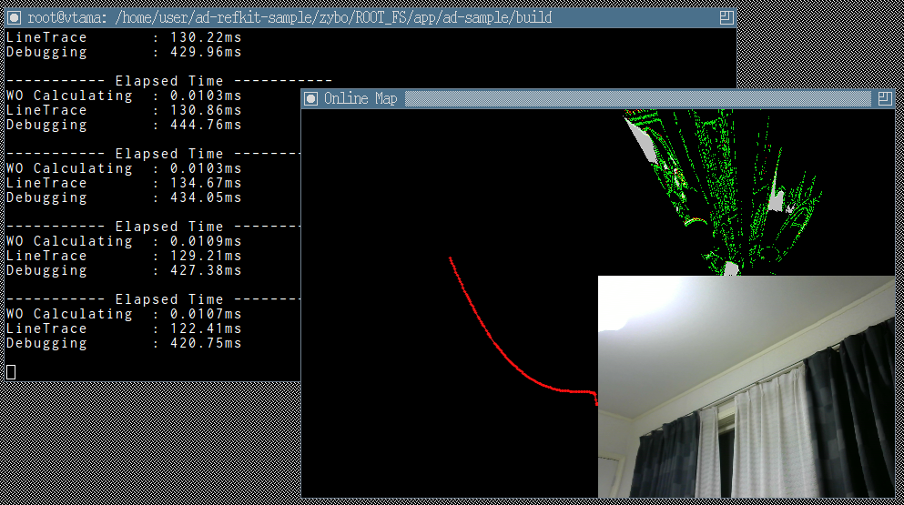

# ad-refkit

1. [Refkit Body](./sec1/index.md)
1. [Building Hardware Design](./sec2/index.md)
1. [Building Linux](./sec3/index.md) ...It is able to skip this step.
1. [Prepare microSD](./sec4/index.md)
1. [Run Application](./sec5/index.md)

