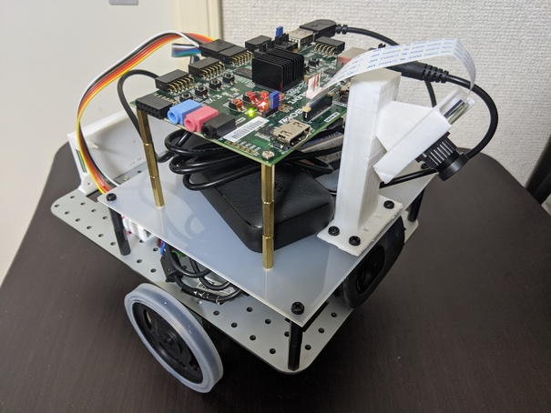

## ad-refkit body

### Requirements

| Item                                      | Qty. | Vendor      | Remark                                                                                                                              |
|-------------------------------------------|:----:|:-----------:|-------------------------------------------------------------------------------------------------------------------------------------|
| ZYBO Z7-20                                | 1    | Digilent    | https://store.digilentinc.com/zybo-z7-zynq-7000-arm-fpga-soc-development-board/                                                     |
| Motor                                     | 2    | Digilent    | https://store.digilentinc.com/dc-motor-gearbox-1-53-gear-ratio-custom-6v-motor-designed-for-digilent-robot-kits/                    |
| Tire and Wheel                            | 2    | Digilent    | https://store.digilentinc.com/wheel-kit-d-slot-pair-abs-injection-molded-wheels-compatible-with-digilent-motor-mounts-limited-time/ |
| Tail Skid                                 | 1    | Digilent    | https://store.digilentinc.com/tail-skid-limited-time/                                                                               |
| Pcam5C                                    | 1    | Digilent    | https://reference.digilentinc.com/reference/add-ons/pcam-5c/start                                                                   |
| Pmod HB5                                  | 2    | Digilent    | https://store.digilentinc.com/pmod-hb5-h-bridge-driver-with-feedback-inputs/                                                        |
| Motor mounter                             | 1    | Digilent    | https://store.digilentinc.com/double-motor-mount-metal-mount-to-affix-a-pair-of-digilent-motors-limited-time/                       |
| Mobile Battery (PowerCore 10000 PD Redux) | 1    | Anker       | https://www.ankerjapan.com/category/COMPACT/A1239.html                                                                              |
| Web camera                                | 1    |             |                                                                                                                                     |
|  - ex. BSW20KM11BK                        |      | iBUFFALO    | https://www.buffalo.jp/product/series/BSW20KM11BK                                                                                   |
|  - ex. Logicool C270                      |      | Logicool    | https://www.logitech.com/en-us/product/hd-webcam-c270                                                                               |
| USB Hub                                   | 1    | SANWASUPPLY | https://www.sanwa.co.jp/product/syohin.asp?code=USB-HTV410BKN                                                                       |
|  - ex. USB-HTV410BKN                      |      | SANWASUPPLY | https://www.sanwa.co.jp/product/syohin.asp?code=USB-HTV410BKN                                                                       |
|  - ex. U2H-TZ427SBK                       |      | Elecom      | https://www.elecom.co.jp/products/U2H-TZ427SBK.html                                                                                 |
| Debug console (character display)         | 1    |             |                                                                                                                                     |
|  - ex. Kyohritsu OLED display module      |      | KYOHRITSU   | https://eleshop.jp/shop/g/gC9B362/                                                                                                  |
|  - ex. Akizuki OLED display module        |      | Akizuki     | http://akizukidenshi.com/catalog/g/gP-08277/                                                                                        |
| micro SD                                  | 1    | -           | more than 8GB                                                                                                                       |
| USB Type-A to DC-jack                     | 1    |             |                                                                                                                                     |
|  - ex. BENSN 10 in 1                      |      |             | https://www.amazon.co.jp/gp/product/B07Y5DCBRL/                                                                                     |
| Battery holder for 4xAAA                  | 1    |             |                                                                                                                                     |
| Base chassis                              | 1    | -           | [STL](../../assets/cad/base_chassis/robocar_base.stl)                                                                               |
| Middle layer chassis                      | 1    | -           |                                                                                                                                     |
| Pcam5C mounter                            | 1    | -           | [STL](../../assets/cad/Pcam5C/Pcam5C_mounter.stl)                                                                                   |
| OLED holder                               | 1    | -           | [STL](../../assets/cad/OLED_holder/OLED_holder.stl)                                                                                 |
| HB5 holder                                | 2    | -           | [STL](../../assets/cad/HB5_holder/HB5_holder.stl)                                                                                   |
| spacers, screws, nuts, washers            |      |             |                                                                                                                                     |
| wires                                     |      |             |                                                                                                                                     |
| Self Adhesive magnetic tape               |      |             |                                                                                                                                     |

