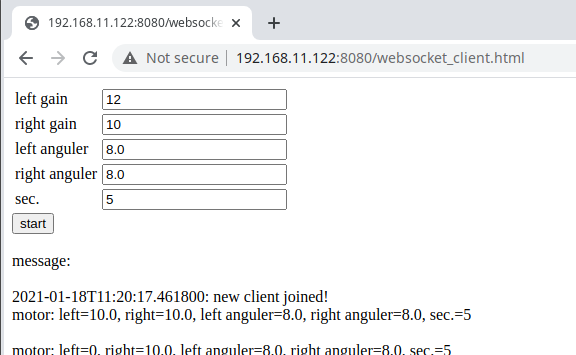

# motor-test-websocket

This example controls motors via Web browser.
It is assumed that host machine and ad-refkit are connected with WiFi.

## Prepare

```
$ mkdir build
$ cd build
$ cmake ..
$ make
$ cd ..
```

## Start server

```
$ cd python
$ python3 -m http.server 8080 &
$ python3 server.py
```

## Access via Web browser

Open http://IP-address-of-ad-refkit:8080/websocket_client.html by Web browser on your host PC.


